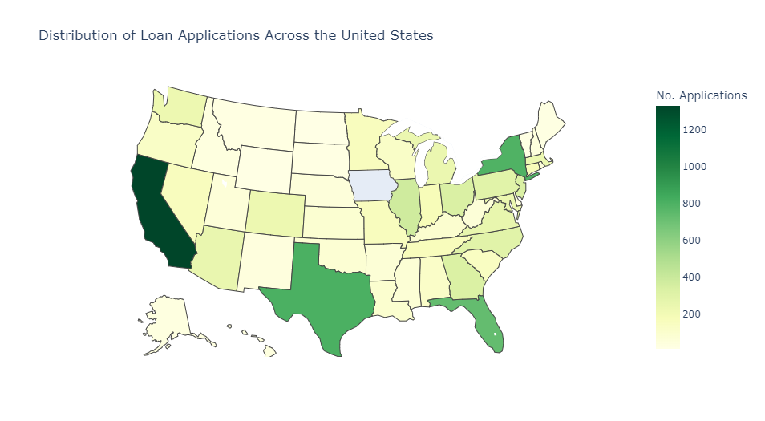
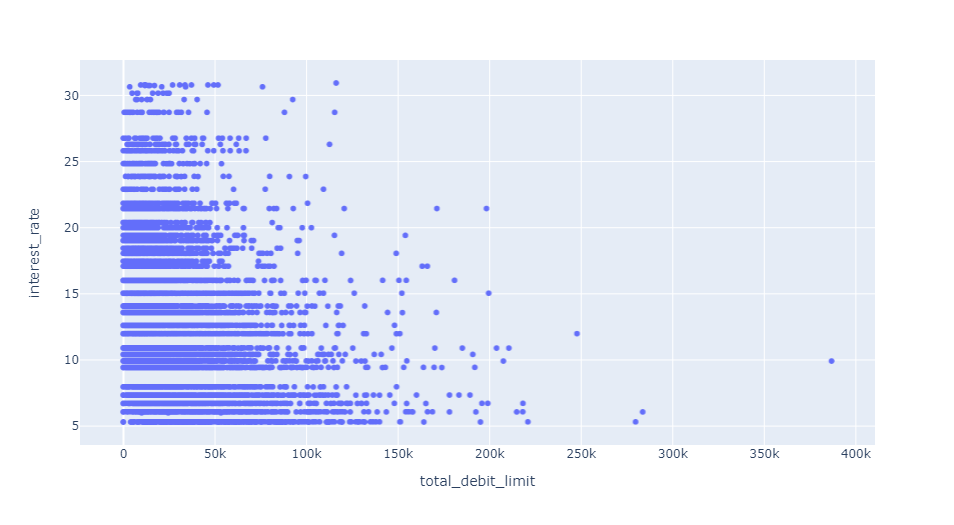

# Case Study 1
This study had the goal of predicting interest rates, using data from Lending Club, 
a peer-to-peer lending platform.

## EDA
Below are visualizations which give insight into the dataset, giving clues as to which
approaches may be successful for interest rate prediction.

### Geographic Loan Distribution

The number of loan applications looks to be roughly proportional to the overall 
population of the state. We will remove state from consideration as a feature, as
it would result in 50 extra features, one-hot encoded. This would result in 
unnecessarily long training times.

### Interest Rate Distribution

Interest rate follows what looks to be a rough beta distribution. The graph looks
to be missing bars, which led to the observation that interest rate is, in fact, a 
categorical variable. This was confirmed [online](https://www.lendingclub.com/investing/investor-education/interest-rates-and-fees). This was also
confirmed by grouping `sub_grade` in the data, and displaying interest rates. Part 
of that table is shown below.

|Sub-grade|Interest Rates     |
|:-------:|:-----------------:|
|A1       |[5.23, 5.31]       |
|A2       |[6.08, 6.07, 6.0]  |
|A3       |[6.72, 6.71]       |
|A4       |[7.34, 7.35]       |
|A5       |[7.96, 7.97]       |

`sub_grade` needs to be removed from our feature set. In a practical application, if we
have access to sub-grade, a simple rule-based model will yield near perfect
predictions as the mapping to interest rate is almost one to one. The decision to 
leave or keep this feature would depend on the model use case in real life. In 
this case study, I exclude it, as a ML model learning a near one-to-one mapping
is wasteful (and frankly boring), and it is much more interesting to try and use the 
rest of the rich feature set to predict interest rates.

### A Note on `application_type`

85% of applications are individual. This makes sense, as the features 
related to joint applications, `annual_income_joint`, `verification_income_joint`,
`debt_to_income_joint` all had around 85% of their values missing.

### Identifying Possible Relations

There look to be weak and possibly non-linear relations between both
`num_open_cc_accounts` and `total_debt_limit` and `interest_rate`.

## Preprocessing

Preprocessing consisted of the following:
* Deletion of bloated/useless features
    * `emp_title`: there are apx. 4500 of these titles. Not very insightful w/o further processing
    * `state`: see EDA
* Deletion of grade-related features
    * `grade` and `sub_grade`: see EDA
* One-hot Encoding of Categorical Features
    * Allows model to work with non-numerical data
* Train/Test Split
    * 20% of the data used as a validation set
    * Given more time, would evaluate models using cross-validation

These pre-processing steps were performed for both the train set, and test set, but
separately as to not introduce unintended biases to the model.

* Null Value Replacement
    * For values in the columns `{'emp_length', 'debt_to_income', 'annual_income_joint', 'debt_to_income_joint'}`, null values were replaced with the feature mean
    * For values in the columns `{'months_since_last_delinq', 'months_since_90d_late', 'months_since_last_credit_inquiry'}` these were filled with a number of months equivalent to 150 years, much longer than a normal human lifespan
    * All other values were filled with 0
* Standardization
    * Training sets were standardized

## Interest Rate Prediction as a Classification Problem
Initially, I approached this a classfication problem. Below is a table of model
results on the validation set (0-1 Loss). Evidently, this approach was a spectacular failure.

|Model   |Validation Score|
|:------:|:--------------:|
|SVC     |11.70%          |
|KNN(k=3)|5.75%           |
|NN      |4.05%           |

*Neural net used linear layers with ReLU activation functions.*

## Interest Rate Predicion as a Regression Problem

I then approached the problem as a regression. This proved more fruitful. I only had
the time to run one approach, a NN, which resulted in a RMSE on the validation set of 
2.97 percentage points. With more time I would run more regression models to try and find a better solution. The RMSE while training is shown above.

### Including `sub_grade` and `grade`

As mentioned in the EDA, including `sub_grade` and `grade` greatly improved model RMSE, 
resulting in a validation RMSE of 0.407 percentage points. The RMSE while training is shown above.

## Assumptions Made

* `sub_grade` and `grade` should not be used in interest rate prediction
* All features required to accurately predict interest rate are 
contained within the dataset
* The treatment of null-values as described in the pre-processing section results in good model performance. This is something else I would experiment with given time