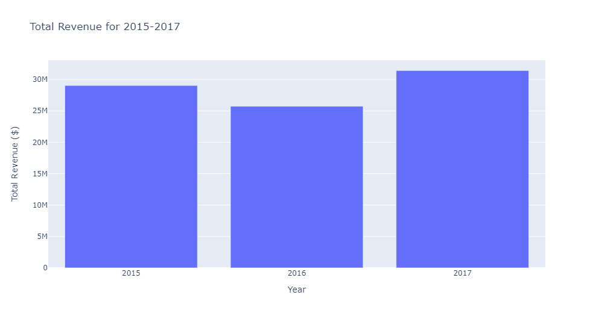
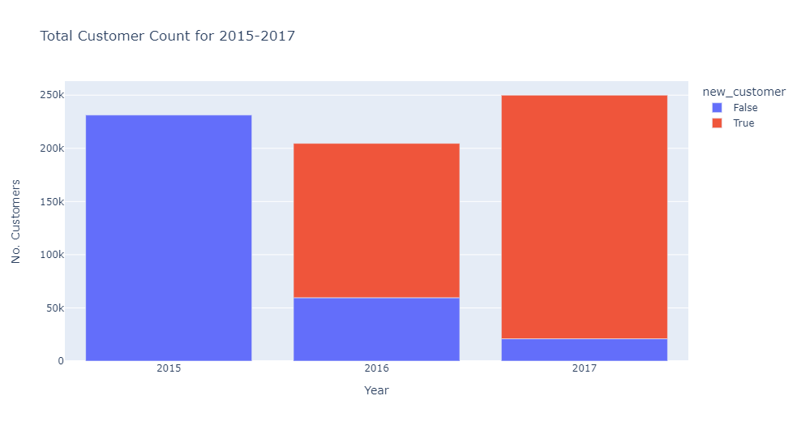

Case Study 2
============

This case study involved the calculation of several statistics on order data from
customers.

Statistics Requested
--------------------

Below are plots for some of the statistics requested.

Total Revenue
^^^^^^^^^^^^^

Total revenue dipped in 2016 before rebounding in 2017.

New & Existing Customer Revenue Statistics
------------------------------------------

.. image:: ./files/customer_revenue_split.png
   :target: ./files/customer_revenue_split.png
   :alt: Customer Revenue Breakdown

For 2016 and 2017 (the years where we can tell which customers are new), we see that
the majority of revenue comes from new customers, rather than from existing customers. Depending on the industry, this data may either be expected or alarming.

New & Existing Customer Count Statistics
----------------------------------------

We see a similar result to that of revenue. This store or business has performs poorly
when it comes to customer retention.

Revenue Lost to Customer Attrition
----------------------------------

Between 2016 and 2017, this store or business lost $4.844M in revenue due to customer attrition. Cannot calculate this statistic for 2015-2016, as it cannot be split into
new and existing customers.
